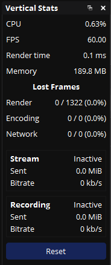

# Vertical Stats for OBS

[](https://github.com/nathan-v/vertical-stats-for-obs/blob/main/LICENSE)
[](https://obsproject.com/)
[](https://github.com/nathan-v/vertical-stats-for-obs/actions/workflows/ci.yml)
[](https://github.com/nathan-v/vertical-stats-for-obs/releases)
[](https://github.com/nathan-v/vertical-stats-for-obs/commits/main)



The OBS Stats panel, turned on its side.

OBS's Stats window is built wide: two columns of numbers and a table of outputs across the bottom. Docked, it wants the whole width of the window; squeezed into a side column, it clips. Vertical Stats shows the same numbers, refreshed every two seconds like the original, in one narrow column that fits more easily wherever you need it, beside the preview or stacked with your other docks.

> **Run the Aitum Vertical plugin? You get its numbers too.** When [Aitum Vertical](https://github.com/Aitum/obs-vertical-canvas) is loaded, a block appears for each vertical stream output and one for the vertical recording. Without it the section is simply absent.

If you have questions or want to talk about this plugin you can find me on [Twitch](https://twitch.tv/The_Nathan_V).

## Contents

- [What it does](#what-it-does)
- [Getting started](#getting-started)
- [How you would actually use it](#how-you-would-actually-use-it)
- [Staying safe](#staying-safe)
- [Status](#status)
- [For developers](#for-developers)
- [License](#license)

## What it does

- **Same numbers, shorter labels.** CPU, FPS, Render time, Memory, Disk free and Disk full in. The two disk rows hide themselves when your profile has no recording folder.
- **Lost frames in one place.** Render, Encoding and Network as `dropped / total (percent)`, so you can see at a glance which one is climbing.
- **Stream and Recording blocks.** Status, Sent and Bitrate per output, coloured with your theme's own warning and danger colours, the same as the built-in panel.
- **Aitum Vertical aware.** Extra blocks for each Aitum stream output and its recording when that plugin is loaded.
- **Never phones home.** No analytics, no tracking, no update checks; this plugin does _not_ call home in any way.

## Getting started

You need OBS Studio 30 or newer. Grab the build for your computer from the [releases page](https://github.com/nathan-v/vertical-stats-for-obs/releases) and install it:

| Platform | How |
| --- | --- |
| Windows | Run `vertical-stats-for-obs-<version>-windows-x64-installer.exe`. It asks you to close OBS first and adds an uninstaller to Windows Settings. |
| macOS | Open the `.pkg`, or copy `vertical-stats-for-obs.plugin` into `~/Library/Application Support/obs-studio/plugins/`. |
| Linux | Install the `.deb` on Ubuntu, or put `vertical-stats-for-obs.so` in `~/.config/obs-studio/plugins/vertical-stats-for-obs/bin/64bit/` and the `data` folder next to `bin`. |

On macOS the `.pkg` and the plugin inside it are signed only with an ad-hoc signature and are not notarized, so Gatekeeper will say the package is from an unidentified developer. Control-click the `.pkg` and choose Open, or allow it under System Settings → Privacy & Security, after checking its checksum.

Restart OBS and open **Docks → Stats (Vertical)**. There is nothing to configure. Every release lists SHA-256 checksums; check your download against them before installing.

## How you would actually use it

**Reading the colours.** A number turns yellow when it deserves a look and red when it needs action, using your theme's own colours:

| Row | Yellow | Red |
| --- | --- | --- |
| FPS | Under 95% of your target frame rate | Under 80% |
| Render time | Over three quarters of the frame budget | Over the whole budget |
| Lost frames (any row) | Over 1% | Over 5% |
| Disk free | Under 5 GB | Under 1 GB |

**Telling the lost frames apart.** Render means your graphics card could not draw frames fast enough; too many sources or filters, or a game hogging the GPU. Encoding means the encoder could not keep up; drop the output resolution or the encoder preset. Network means frames were dropped on the way to the service; your bitrate is too high for the connection. They are the same three rows the built-in panel has, kept together.

**Knowing when the disk will fill.** While a recording runs, "Disk full in" shows hours and minutes left at the current bitrate, updated every 30 seconds. The two disk rows only appear once your profile has a recording folder set.

**Streaming vertical with Aitum.** Each Aitum stream output gets its own block, named after the server you gave it in Aitum, with status, data sent, bitrate and dropped frames. Remove a server in Aitum mid-stream and its block goes inactive instead of vanishing, so the column does not jump under your hand.

**Starting the count over.** The Reset button zeroes the lost-frame counters, the same as the built-in panel's Reset. Handy after a hiccup you have already dealt with.

## Staying safe

- **It runs inside OBS.** Like every OBS plugin it loads into the OBS process with the same access OBS has. Install builds from the releases page and check the checksums, or build it yourself.
- **It reads, never writes.** The dock reads libobs counters, output state and your profile's recording folder, the last one only to measure free disk space. It changes no OBS or Aitum setting and writes nothing to disk.
- **No network.** The plugin opens no connections.

See [SECURITY.md](SECURITY.md) to report a problem.

## Status

Working. Verified by hand in OBS on macOS (where the screenshot comes from) and Windows. The Linux build passes CI; the arithmetic has a unit test suite that runs on all three, and the dock itself is checked by hand. Linux builds are only tested against the OBS PPA on Ubuntu 24.04. Other distributions should work if their `libobs` matches the OBS you run, but nobody has checked.

## For developers

Built on the official [obs-plugintemplate](https://github.com/obsproject/obs-plugintemplate); CMake 3.28+.

```bash
cmake --preset macos                                   # or windows-x64, ubuntu-x86_64; first run downloads OBS and Qt
cmake --build --preset macos --config RelWithDebInfo
cmake --install build_macos --config RelWithDebInfo --prefix release
```

Ubuntu wants `build-essential cmake ninja-build pkg-config libobs-dev obs-studio qt6-base-dev qt6-base-private-dev` from apt first. On macOS install the bundle from `release/`, not the copy under `build_macos/rundir/`; that one is made before Xcode signs it, and Apple Silicon refuses to load an unsigned bundle. The Windows installer needs [Inno Setup 6](https://jrsoftware.org/isinfo.php); `pwsh ./installer/windows/build-installer.ps1`.

The arithmetic (thresholds, unit scaling, bitrate and baseline tracking, the disk-full estimate, Aitum name parsing, recording-path selection) lives in `src/stats-logic.cpp` with no Qt or libobs in it, and has a unit test suite that needs only a C++17 compiler:

```bash
cmake -S tests -B build_tests && cmake --build build_tests && ctest --test-dir build_tests
```

Aitum detection, for the curious: Aitum Vertical registers libobs proc handlers at load, and the dock probes one side-effect-free handler (`aitum_vertical_get_video`) on each refresh until it answers, which also covers Aitum loading after this plugin. Its outputs are then found by name: `vertical_canvas_stream`, `vertical_canvas_stream_<server>` and `vertical_canvas_record`. The plugin deliberately never calls Aitum's settings handlers; those flip a flag that turns off Aitum's own stream-settings page… ask me how I know.

Format check before pushing; `./build-aux/run-clang-format --check` (clang-format 19.1.x) and `./build-aux/run-gersemi --check`.

`.github/workflows/ci.yml` runs both format checks, the unit tests on Ubuntu, macOS and Windows, and builds all three platforms with the Windows installer on every push and pull request. A `x.y.z` tag creates a draft release with checksums. [CONTRIBUTING.md](CONTRIBUTING.md) has the workflow and what to check by hand in OBS.

## License

GPL-2.0-or-later; see [LICENSE](LICENSE). The stats logic is derived from OBS Studio's `frontend/widgets/OBSBasicStats.cpp` (Copyright (C) 2023 Lain Bailey, GPL v2+), which is why this project is GPL rather than MIT. PRs and constructive feedback are welcome.
